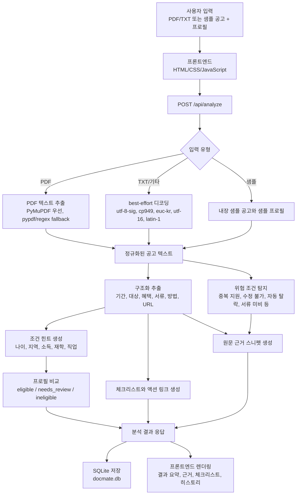
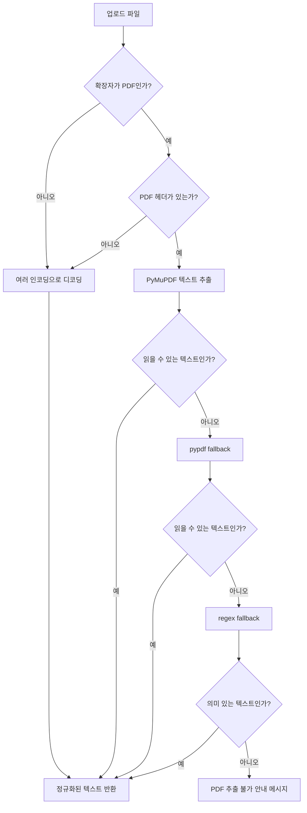
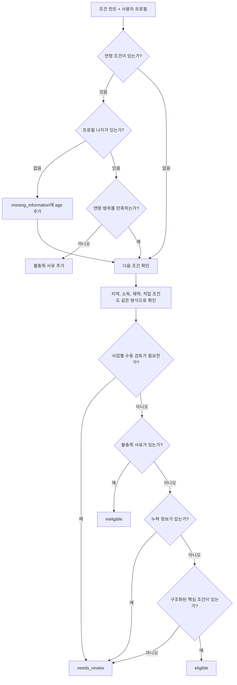
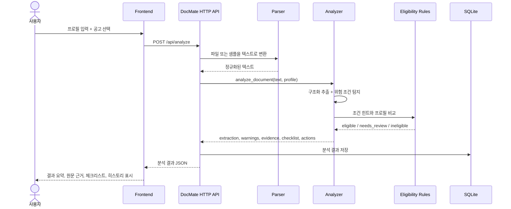
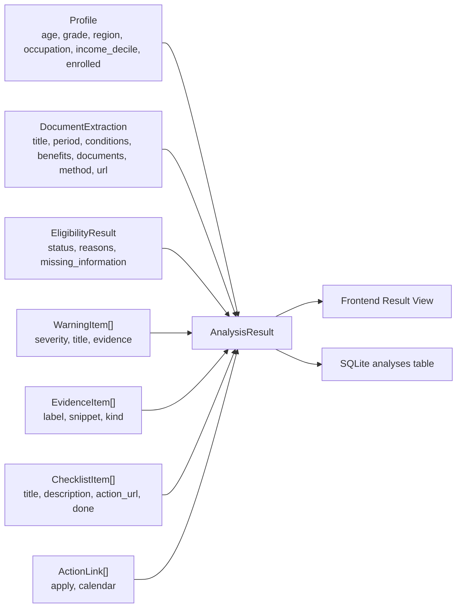

# DocMate 분석 방법 및 기술 문서

작성일: 2026-05-20  
대상 버전: 로컬 발표 데모 버전

## 한 줄 요약

DocMate는 장학금·청년정책 공고를 텍스트로 변환한 뒤, 규칙 기반 추출과 프로필 비교를 통해 `신청 가능`, `추가 확인 필요`, `신청 불가`를 판정하고, 원문 근거·위험 조건·체크리스트·히스토리 비교로 사용자의 신청 준비를 돕는 로컬 분석 서비스이다.

## 현재 분석 방식

현재 버전은 외부 AI API나 LLM을 호출하지 않는다. 발표 데모에서 결과가 항상 재현되도록, Python 코드 안에 정의된 규칙 기반 파이프라인을 사용한다.

## 생성형 AI 사용 여부

현재 DocMate의 PDF 분석과 요약 정리는 생성형 인공지능을 사용하지 않는다. 즉, ChatGPT나 Claude 같은 모델이 공고를 읽고 새 요약문을 생성하는 구조가 아니다.

대신 다음 방식으로 "요약처럼 보이는 구조화 결과"를 만든다.

1. PDF에서 텍스트를 추출한다.
2. `신청 기간`, `지원 대상`, `제출 서류`처럼 공고에 자주 등장하는 라벨을 찾는다.
3. 해당 라벨 아래 문장을 수집해 표준 항목에 넣는다.
4. `만 18세 이상`, `부산 거주`, `소득 2분위 이하` 같은 조건 표현을 정규식으로 찾아 프로필과 비교한다.
5. 중복 지원 불가, 자동 탈락, 서류 미비 같은 위험 키워드를 탐지한다.
6. 추출 항목을 바탕으로 체크리스트와 원문 근거를 생성한다.

따라서 현재 결과는 "생성형 요약"이 아니라 "규칙 기반 정보 추출 + 재구성 + 조건 판정"에 가깝다. 이 방식은 데모 재현성과 설명 가능성이 좋지만, 공고 문장이 매우 복잡하거나 라벨이 불분명할 때는 사람처럼 의미를 깊게 해석하지 못한다. 그런 경우에는 `추가 확인 필요`로 보수적으로 판정하도록 설계했다.

분석은 크게 6단계로 진행된다.

1. 입력 수집: 사용자가 PDF/TXT 파일, 샘플 공고, 프로필 정보를 입력한다.
2. 텍스트 추출: PDF는 PyMuPDF를 우선 사용하고, TXT/기타 파일은 여러 인코딩을 순서대로 시도한다.
3. 구조화 추출: 공고에서 신청 기간, 지원 대상, 지원 내용, 제출 서류, 신청 방법, 신청 URL을 찾는다.
4. 조건 힌트 생성: 나이, 거주지, 소득구간, 재학 여부, 직업 조건을 정규식과 키워드로 추출한다.
5. 프로필 판정: 추출된 조건과 사용자의 프로필을 비교해 신청 가능성을 보수적으로 판단한다.
6. 실행 자료 생성: 원문 근거, 위험 조건, 체크리스트, 신청 링크, 캘린더 링크, 저장 히스토리를 만든다.

## 전체 흐름도

## 분석 파이프라인 상세

### 1. 입력과 프로필 정규화

관련 코드: `backend/app/server.py`, `backend/app/models.py`

서버는 세 가지 요청 형식을 처리한다.

- JSON: 테스트나 API 호출에 적합하다.
- multipart form-data: 실제 파일 업로드에 사용한다.
- x-www-form-urlencoded: 가벼운 폼 요청을 처리한다.

프로필은 `Profile` 데이터 클래스로 정규화된다. 나이와 소득구간은 숫자로 변환하고, 재학 여부는 `true/false`, `재학/비재학` 같은 값을 불리언으로 바꾼다. 비어 있는 값은 `None`으로 두어 이후 판정에서 `추가 확인 필요`로 처리할 수 있게 한다.

### 2. 문서 텍스트 추출

관련 코드: `backend/app/parser.py`

PDF는 다음 순서로 텍스트를 추출한다.

1. PyMuPDF(`fitz`)로 페이지별 텍스트를 추출한다.
2. PyMuPDF가 실패하면 선택적으로 `pypdf`를 시도한다.
3. 그래도 실패하면 PDF 내부에서 사람이 읽을 수 있는 문자열 run을 정규식으로 찾아 fallback한다.
4. 충분히 사람이 읽을 수 있는 텍스트가 아니면 fallback 안내 메시지를 반환한다.

TXT나 기타 파일은 `utf-8-sig`, `cp949`, `euc-kr`, `utf-16`, `latin-1` 순서로 디코딩을 시도한다. 줄바꿈과 불필요한 공백은 정규화한다.

## 텍스트 추출 흐름도

### 3. 구조화 추출

관련 코드: `backend/app/analyzer.py`

분석기는 먼저 공고 텍스트를 줄 단위로 정규화한다. 이후 다음 섹션 라벨을 기준으로 값을 수집한다.

| 추출 항목 | 인식 라벨 예시 |
| --- | --- |
| 신청 기간 | 신청 기간, 신청기간, 접수 기간, 모집 기간 |
| 지원 대상 | 지원 대상, 지원대상, 신청 자격, 자격 요건, 지원 조건 |
| 지원 내용 | 지원 내용, 지원내용, 혜택, 지원 금액 |
| 제출 서류 | 제출 서류, 필수 서류, 구비 서류, 준비 서류 |
| 신청 방법 | 신청 방법, 신청방법, 접수 방법 |
| 신청 URL | 신청 URL, 신청 링크, 접수 URL |

라벨을 찾으면 다음 라벨이 나오기 전까지의 줄을 해당 섹션 값으로 수집한다. 목록형 값은 쉼표, 가운데점, 세미콜론 등을 기준으로 나누고 중복을 제거한다. URL은 `http://` 또는 `https://` 패턴으로 찾되, PDF 메타데이터에서 자주 등장하는 `w3.org`, `adobe.com`, `purl.org` 같은 링크는 제외한다.

### 4. 조건 힌트 생성

관련 코드: `backend/app/analyzer.py`

지원 대상 문장과 전체 텍스트에서 판정에 필요한 힌트를 만든다.

- 연령: `만 18세 이상`, `35세 이하`, `18세~35세` 같은 표현
- 거주지: `부산 거주`, `서울 거주` 같은 표현
- 소득: `소득 2분위 이하`, `학자금 지원구간 9구간 이하` 같은 표현
- 재학: `재학생`, `재학` 키워드
- 직업/상태: `대학생`, `미취업`, `구직자`, `재직자`, `직장인` 키워드
- 수동 검토: 국가장학금 기본계획처럼 사업별 세부요건 확인이 필요한 문서

이 단계의 결과는 `DocumentExtraction.condition_hints`에 저장되고, 이후 자격 판정에 사용된다.

### 5. 위험 조건 탐지

관련 코드: `backend/app/analyzer.py`

공고 전체 텍스트에서 심사와 신청 준비에 중요한 위험 조건을 키워드 기반으로 탐지한다.

| 위험 조건 | 예시 키워드 |
| --- | --- |
| 중복 지원 불가 | 중복 지원 불가, 중복신청 불가, 중복 수혜 불가 |
| 수정 불가 | 수정 불가, 내용 수정 불가, 정정 불가 |
| 자동 탈락 | 자동 탈락, 자동탈락, 탈락 처리 |
| 서류 미비 | 서류 미비, 제출 서류 미비, 미비 시 탈락 |
| 국적 제한 | 국적자만, 국적 제한, 외국인 제외 |
| 사업별 세부요건 확인 | 사업별 세부요건, 사업별 지원 대상, 사업별 시행계획 |

탐지 결과는 `critical` 또는 `warning` 심각도를 가진 `WarningItem`으로 변환된다.

### 6. 자격 판정

관련 코드: `backend/app/eligibility.py`

자격 판정은 보수적인 규칙을 따른다.

- 조건을 충족하지 못하는 명확한 이유가 있으면 `ineligible`
- 필요한 프로필 정보가 없거나 사업별 세부요건 확인이 필요하면 `needs_review`
- 구조화된 조건을 모두 만족하면 `eligible`
- 공고 조건을 충분히 구조화하지 못하면 무리하게 가능 판정을 하지 않고 `needs_review`

## 자격 판정 흐름도

### 7. 원문 근거 생성

관련 코드: `backend/app/analyzer.py`

DocMate는 분석 결과를 설명 가능하게 만들기 위해 원문 근거를 함께 만든다.

- 추출 항목별로 라벨이 포함된 줄을 먼저 찾는다.
- 라벨이 없으면 추출값과 일치하는 줄을 찾는다.
- 위험 조건은 키워드가 등장한 문장 또는 줄을 근거로 사용한다.
- 같은 근거는 중복 제거하고 최대 10개까지 반환한다.

이 방식은 완전한 자연어 추론은 아니지만, 발표 데모에서 "어떤 문장을 근거로 판단했는가"를 보여주는 데 적합하다.

### 8. 체크리스트와 액션 링크 생성

관련 코드: `backend/app/checklist.py`, `backend/app/analyzer.py`

추출된 제출 서류는 각각 `준비` 항목으로 바뀐다. 예를 들어 `주민등록초본`이 있으면 `주민등록초본 준비`라는 체크리스트가 생성된다. 일부 문서 키워드는 `gov.kr` 링크로 연결하고, 신청 URL이 있으면 신청 방법 확인과 마감일 확인 항목에도 연결한다.

신청 기간에서 마감일을 추출할 수 있으면 Google Calendar 등록 URL도 만든다.

### 9. 저장과 히스토리

관련 코드: `backend/app/storage.py`

분석 결과는 로컬 SQLite 데이터베이스 `docmate.db`에 저장된다. 저장되는 값은 업로드 파일 자체가 아니라 추출 텍스트, 프로필, 분석 결과 JSON이다.

저장 필드:

- `id`
- `created_at`
- `filename`
- `document_text`
- `profile`
- `extraction`
- `eligibility`
- `warnings`
- `checklist`
- `evidence`
- `actions`

프론트엔드는 저장된 결과를 히스토리에서 다시 불러오고, 두 개의 공고를 비교할 수 있다.

## 기술 스택

| 영역 | 사용 기술 | 역할 |
| --- | --- | --- |
| 백엔드 서버 | Python `http.server`, `ThreadingHTTPServer` | 로컬 API와 정적 파일 제공 |
| 데이터 모델 | Python `dataclasses` | 프로필, 추출 결과, 판정 결과, 체크리스트 구조화 |
| PDF 추출 | PyMuPDF(`fitz`) | 텍스트 기반 PDF의 페이지별 텍스트 추출 |
| fallback 파싱 | 정규식, best-effort decoding | PDF/TXT 추출 실패 시 안전한 대체 처리 |
| 저장소 | SQLite, Python `sqlite3` | 로컬 분석 히스토리 저장 |
| 프론트엔드 | HTML, CSS, Vanilla JavaScript | 입력 폼, 결과 렌더링, 히스토리, 비교, 데모 모드 |
| 브라우저 통신 | Fetch API | `/api/analyze`, `/api/samples`, `/api/analyses` 호출 |
| 로컬 상태 | `localStorage` | 입력 초안과 데모 흐름 보조 |
| 내보내기 | Markdown Blob 다운로드 | 현재 분석 결과를 `.md` 체크리스트로 저장 |
| 테스트 | Python `unittest`, `node --check`, smoke script | 파이프라인, 서버, 저장소, 프론트 문법 검증 |

## API 흐름

## 데이터 모델 흐름

## 설계상 중요한 판단

### 로컬 안정성 우선

경진대회 발표에서는 네트워크 API 키, 외부 모델 장애, 배포 환경 변수가 데모 실패 요인이 될 수 있다. 그래서 현재 버전은 외부 AI 호출 없이 로컬에서 재현 가능한 규칙 기반 분석을 우선했다.

### 보수적인 판정

조건을 확실히 만족한다고 판단할 수 없으면 `eligible`이 아니라 `needs_review`를 반환한다. 이는 사용자가 잘못된 자동 판정을 믿고 신청 기회를 놓치거나 잘못 신청하는 위험을 줄이기 위한 설계다.

### 설명 가능한 결과

분석 결과에는 원문 근거가 함께 제공된다. 이 구조는 심사위원에게 "자동화 결과를 어떻게 검증할 수 있는가"를 설명하는 핵심 장치다.

### 파일 원본 미저장

현재 구현은 업로드 파일 원본을 보관하지 않는다. 분석 히스토리에는 추출 텍스트와 분석 결과 JSON이 저장된다. 실제 출시 단계에서는 이 부분도 개인정보 정책과 함께 더 엄격한 저장·삭제 정책이 필요하다.

## 현재 한계

- 이미지 기반 PDF나 스캔본 OCR은 아직 지원하지 않는다.
- 규칙 기반 추출이라 공고 문체가 크게 다르면 `needs_review`가 늘어날 수 있다.
- 샘플 공고와 텍스트 기반 공고에는 강하지만, 대규모 실공고 검증 데이터셋은 아직 부족하다.
- 계정, 권한, 암호화, 배포, 모니터링 같은 실제 출시 운영 기능은 별도 개발이 필요하다.
- LLM 기반 질의응답이나 모호한 조건 해석은 아직 구현하지 않았다.

## 향후 확장 방향

- OCR 추가로 스캔형 PDF 처리
- 기관별 공고 템플릿과 예외 규칙 관리
- 실제 공고 데이터셋 기반 회귀 테스트
- OpenAI/Claude 등 LLM provider adapter 추가
- 사용자 계정, 개인정보 보호, 데이터 삭제 요청 처리
- 마감일 캘린더 연동과 알림
- 대학/청년센터용 기관 대시보드
