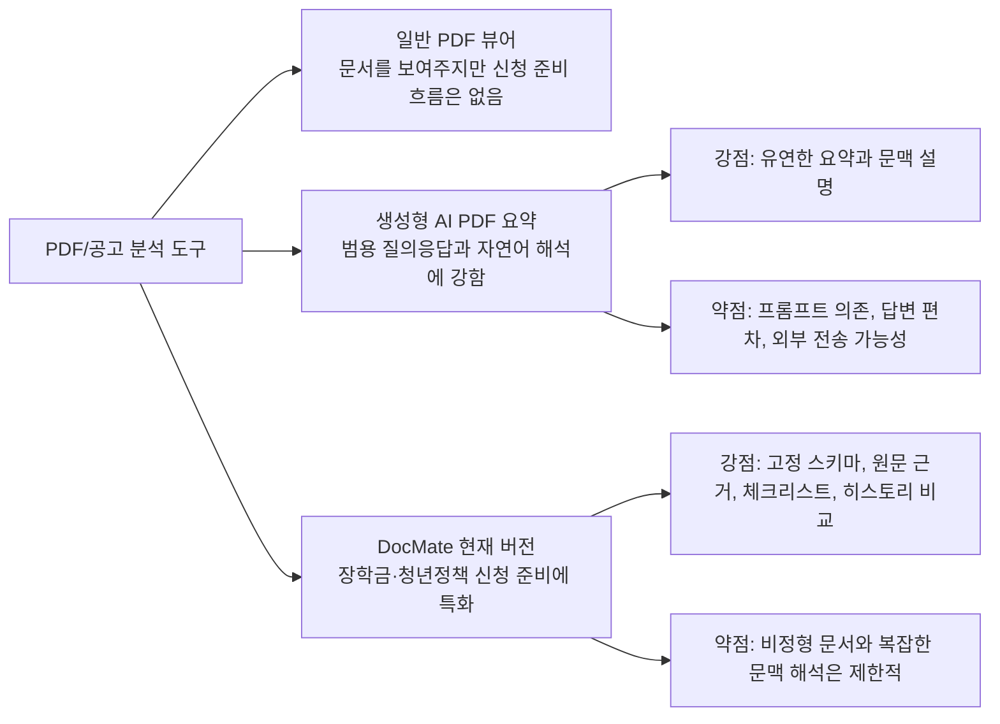

# DocMate와 생성형 AI PDF 분석의 차별점

작성일: 2026-05-20  
대상 버전: 로컬 발표 데모 버전

## 결론

DocMate는 ChatGPT나 Claude에 PDF를 넣고 "분석해줘"라고 요청하는 범용 생성형 AI 사용 방식과 경쟁하는 제품이라기보다, 장학금·청년정책 공고 신청 준비에 특화된 업무 흐름 도구이다.

가장 중요한 차이는 다음 한 문장으로 설명할 수 있다.

> 생성형 AI는 문서를 읽고 답변을 생성하는 범용 대화 도구이고, DocMate는 공고를 신청 가능성·위험 조건·준비 서류·원문 근거·체크리스트·히스토리 비교로 구조화하는 목적형 서비스이다.

현재 DocMate는 생성형 AI를 사용하지 않는다. 대신 규칙 기반 정보 추출과 프로필 조건 판정을 사용한다. 따라서 모든 PDF를 자유롭게 해석하는 능력은 생성형 AI보다 약하지만, 특정 도메인에서는 결과 형식이 일정하고 설명 가능하며, 발표 데모에서 재현성이 높다.

## 비교 표

| 비교 항목 | 생성형 AI에 PDF 업로드 | DocMate |
| --- | --- | --- |
| 목적 | 범용 질의응답, 요약, 해석 | 장학금·청년정책 신청 준비 |
| 결과 형태 | 프롬프트에 따라 달라지는 자연어 답변 | 고정 스키마: 신청 상태, 기간, 위험 조건, 할 일, 원문 근거 |
| 재현성 | 같은 문서라도 답변이 달라질 수 있음 | 같은 입력이면 같은 규칙으로 분석 |
| 설명 가능성 | 모델 답변의 근거가 불명확할 수 있음 | 원문 스니펫을 함께 표시 |
| 판정 방식 | 모델의 문맥 추론에 의존 | 추출된 조건과 사용자 프로필을 규칙으로 비교 |
| 사용자 입력 | 사용자가 직접 질문을 잘 써야 함 | 선택형 프로필 입력과 공고 선택 흐름 제공 |
| 실행 전환 | 답변을 보고 사용자가 다시 정리해야 함 | 제출 서류와 마감일을 체크리스트로 자동 변환 |
| 반복 사용 | 매번 PDF 업로드와 프롬프트 작성 필요 | 히스토리 저장, 재조회, 공고 비교 가능 |
| 개인정보 | 보통 외부 AI 서비스로 문서/프로필 전송 | 현재 데모는 로컬 실행, 외부 AI API 미사용 |
| 검증 | 프롬프트와 모델 상태에 따라 변동 | 코드 테스트와 규칙 검증 가능 |
| 약점 | 환각, 답변 편차, 프롬프트 의존 | 비정형 문서와 복잡한 문맥 해석에 약함 |

## 사용자 경험의 차이

생성형 AI에 PDF를 넣는 방식은 사용자가 질문을 잘 해야 한다. 예를 들어 다음과 같은 프롬프트를 직접 작성해야 한다.

```text
이 장학금 공고에서 신청 기간, 지원 대상, 제출 서류, 중복지원 제한,
내가 신청 가능한지 여부, 준비해야 할 일을 표로 정리해줘.
내 조건은 28세, 부산 거주, 구직자, 소득 1분위야.
```

반면 DocMate는 사용자가 프롬프트를 작성하지 않아도 되도록 흐름을 제품 안에 고정한다.

1. 나이, 거주지, 직업, 소득구간, 재학 상태를 선택한다.
2. PDF/TXT 또는 샘플 공고를 선택한다.
3. `분석하기`를 누른다.
4. 신청 가능 여부, 위험 조건, 원문 근거, 체크리스트를 같은 형식으로 확인한다.
5. 히스토리에서 여러 공고를 비교한다.

즉, DocMate의 차별점은 "더 똑똑한 범용 요약"이 아니라 "반복되는 신청 준비 과정을 제품화한 것"이다.

## 분석 결과의 차이

생성형 AI는 자연어 답변을 잘 만들 수 있지만, 결과 형식이 프롬프트에 크게 의존한다. 사용자가 "짧게 요약해줘"라고 하면 위험 조건이 빠질 수 있고, "자세히 분석해줘"라고 하면 발표나 신청 준비에 불필요한 설명이 길어질 수 있다.

DocMate는 결과를 항상 다음 항목으로 나눈다.

- 신청 상태: `신청 가능`, `추가 확인 필요`, `신청 불가`
- 결과 요약: 신청 기간, 위험 조건 수, 할 일 수, 신청 링크 여부
- 판정 요약: 왜 그렇게 판단했는지
- 사용 프로필: 실제 판정에 사용된 입력값
- 원문 근거: 추출 항목과 위험 조건의 근거 문장
- 핵심 정보: 기간, 방법, URL
- 지원 대상, 지원 내용, 준비 서류, 유의사항
- 체크리스트: 사용자가 바로 준비할 항목
- 히스토리 비교: 여러 공고의 혜택·서류·위험 조건 비교

이 구조는 발표와 서비스 사용 모두에서 장점이 있다. 사용자는 매번 다른 답변 형식을 해석하지 않아도 되고, 심사위원은 서비스가 어떤 데이터를 어떻게 처리하는지 확인할 수 있다.

## 신뢰성과 검증의 차이

생성형 AI의 답변은 유용하지만, 다음 문제가 생길 수 있다.

- 원문에 없는 내용을 자연스럽게 말할 수 있다.
- 조건을 과도하게 낙관적으로 해석할 수 있다.
- 같은 문서라도 질문 방식에 따라 답변이 달라질 수 있다.
- 어떤 원문을 근거로 결론을 냈는지 바로 확인하기 어렵다.

DocMate는 이 문제를 완전히 해결한 것은 아니지만, 다른 방식으로 줄인다.

- 원문 근거 스니펫을 결과와 함께 표시한다.
- 조건을 확실히 판단하지 못하면 `추가 확인 필요`로 둔다.
- 위험 조건을 별도 항목으로 분리한다.
- 같은 입력은 같은 규칙으로 처리한다.
- 테스트 가능한 코드 경로로 분석 파이프라인을 구성한다.

## 개인정보와 운영 관점의 차이

생성형 AI에 PDF를 업로드하면 문서와 사용자의 조건이 외부 서비스로 전송될 수 있다. 장학금·정책 공고 자체는 공개 문서인 경우가 많지만, 사용자의 소득구간, 거주지, 재학 상태, 구직 상태 같은 정보는 민감할 수 있다.

현재 DocMate 데모는 로컬에서 실행되고 외부 AI API를 호출하지 않는다. 원본 파일도 저장하지 않고, 추출 텍스트와 분석 결과 JSON을 로컬 SQLite에 저장한다. 실제 출시 단계에서는 암호화, 계정 격리, 개인정보 처리방침, 삭제 요청 처리 등이 추가되어야 하지만, 현재 데모의 방향성은 "민감한 신청 조건을 외부 모델에 보내지 않고도 기본 분석 흐름을 만든다"에 가깝다.

## DocMate가 더 적합한 상황

DocMate는 다음 상황에서 더 설득력이 있다.

- 장학금·청년정책 공고처럼 반복되는 형식의 문서를 처리할 때
- 신청 가능 여부와 준비 서류를 같은 형식으로 보고 싶을 때
- 사용자가 프롬프트를 직접 쓰지 않아도 되는 서비스가 필요할 때
- 결과를 히스토리로 저장하고 여러 공고를 비교해야 할 때
- 원문 근거와 위험 조건을 함께 확인해야 할 때
- 발표 데모처럼 결과 재현성이 중요한 환경일 때
- 개인정보를 외부 AI 서비스로 보내지 않는 로컬 분석 흐름이 필요할 때

## 생성형 AI가 더 적합한 상황

반대로 생성형 AI가 더 나은 상황도 있다.

- 구조가 없는 자유서술형 문서를 넓게 요약할 때
- 사용자가 "이 표현이 무슨 뜻인지" 자연어로 질문하고 싶을 때
- 공고의 예외 조항이나 모호한 문맥을 깊게 해석해야 할 때
- 여러 문서 사이의 의미적 차이를 유연하게 설명해야 할 때
- 표, 본문, 각주가 복잡하게 섞인 문서를 사람이 읽듯 해석해야 할 때

따라서 DocMate의 현재 차별점은 "생성형 AI보다 모든 문서를 더 잘 읽는다"가 아니다. 정확한 표현은 "특정 도메인의 반복 업무를 안정적인 제품 흐름으로 만든다"이다.

## 발표에서 사용할 수 있는 답변

심사위원이 "그냥 ChatGPT에 PDF 넣으면 되는 것 아닌가요?"라고 물으면 다음처럼 답하면 좋다.

> 맞습니다. 범용 생성형 AI도 PDF를 요약할 수 있습니다. 다만 DocMate는 범용 요약 도구가 아니라 장학금·청년정책 신청 준비에 특화된 업무 흐름입니다. 사용자가 매번 프롬프트를 쓰는 대신 프로필을 선택하고 공고를 넣으면, 신청 가능 여부, 위험 조건, 제출 서류, 원문 근거, 체크리스트, 히스토리 비교가 항상 같은 형식으로 나옵니다. 현재는 생성형 AI를 쓰지 않는 규칙 기반 데모라 비정형 문서 해석에는 한계가 있지만, 재현성과 설명 가능성, 로컬 개인정보 처리, 반복 사용 흐름에서 차별점이 있습니다.

더 짧게 말하면 다음과 같다.

> 생성형 AI는 문서를 읽어주는 도구이고, DocMate는 신청 준비 과정을 표준화하는 서비스입니다.

심사 대응에서 피해야 할 표현:

- "ChatGPT보다 PDF를 더 잘 분석한다."
- "모든 공고 PDF를 자동으로 정확히 판정한다."
- "생성형 AI 없이도 실제 출시 수준의 정확도를 보장한다."

대신 사용할 표현:

- "현재 버전은 구조화된 장학금·청년정책 공고에 초점을 둔 로컬 데모입니다."
- "생성형 AI의 범용 요약과 달리, 신청 준비에 필요한 결과 형식을 제품 안에 고정했습니다."
- "애매한 조건은 가능하다고 단정하지 않고 `추가 확인 필요`로 남기는 보수적 판정을 택했습니다."

## 제품 포지셔닝

DocMate의 현재 포지션은 `AI 요약 챗봇`이 아니라 `정책 공고 신청 준비 콘솔`이다.



## 향후 하이브리드 전략

장기적으로는 생성형 AI를 배제할 필요가 없다. 오히려 DocMate의 구조화 파이프라인 위에 LLM을 보조적으로 붙이면 더 강해질 수 있다.

권장 방향:

1. 현재 규칙 기반 파이프라인으로 기본 항목을 안정적으로 추출한다.
2. LLM은 라벨이 불분명한 문장, 예외 조항, 복잡한 문맥 해석에만 사용한다.
3. LLM 출력은 바로 사용자에게 보여주지 않고, 정해진 스키마로 검증한다.
4. 모든 결론에는 원문 근거를 붙인다.
5. 최종 판정은 보수적으로 처리하고, 애매하면 `추가 확인 필요`로 남긴다.

이 전략을 쓰면 생성형 AI의 유연성과 DocMate의 재현성·설명 가능성을 함께 가져갈 수 있다.

## 차별점 한 장 요약

- DocMate는 모든 PDF를 범용으로 요약하는 서비스가 아니다.
- 현재는 구조가 있는 장학금·청년정책 공고에 특화되어 있다.
- 생성형 AI를 사용하지 않아 결과가 더 예측 가능하고 재현 가능하다.
- 사용자가 프롬프트를 작성하지 않아도 같은 절차로 분석할 수 있다.
- 원문 근거, 위험 조건, 체크리스트, 히스토리 비교가 제품 안에 고정되어 있다.
- 약점은 비정형 문서 해석과 복잡한 문맥 이해다.
- 향후 LLM을 추가하면 비정형 해석을 보완하되, DocMate의 구조화·검증 흐름은 유지하는 방향이 적합하다.
